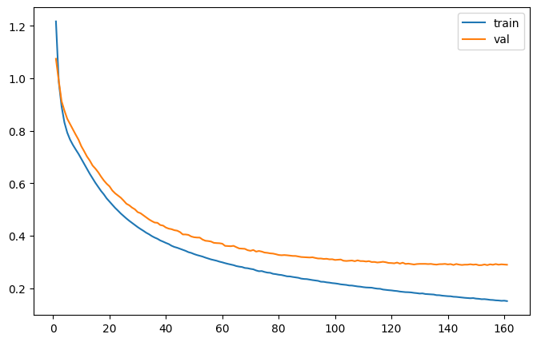

# English → Hindi Transliteration  
### **A Sequence-to-Sequence Based Transliteration Model**

This project implements an **LSTM-based Seq2Seq transliteration system** designed to convert **English text into Hindi script**.  
It focuses on learning character-level mappings using an encoder–decoder architecture.

---

## Training Logs

  

---

## Features
- **Character-level transliteration**
- **Seq2Seq architecture with LSTM Encoder–Decoder**
- **Training visualization & logs**
- Easy to extend to other language pairs